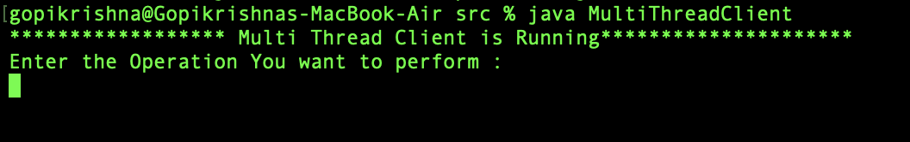
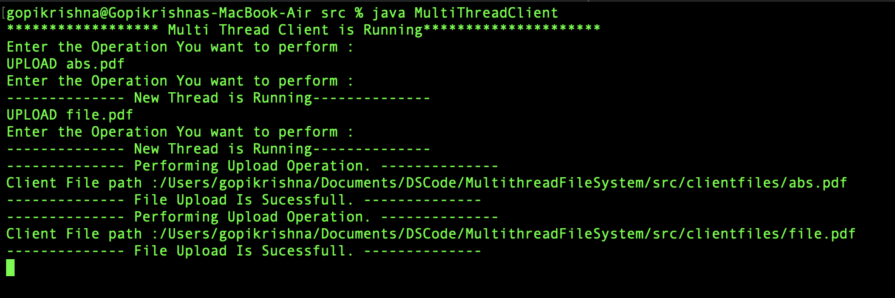
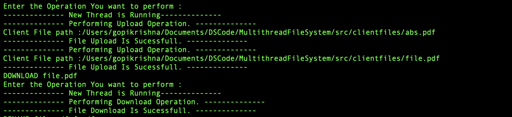
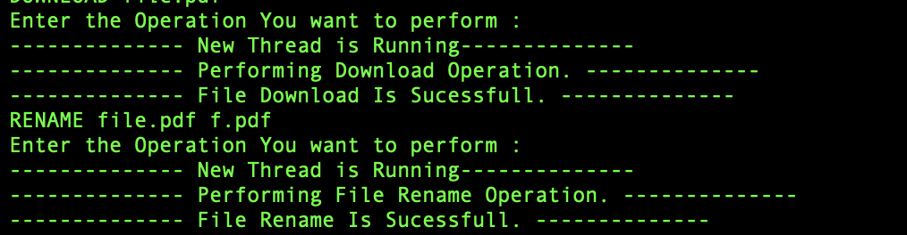
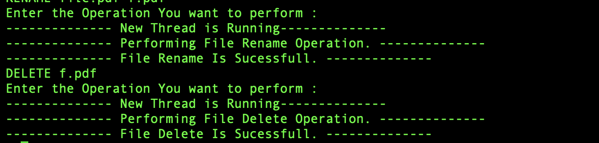

# MULTITHREADING FILE SYSTEM
## Problem Statement
Implement a Multi-Threaded File Server that supports UPLOAD, DOWNLOAD, DELETE, and RENAME file operations. Use different folders to hold files downloaded to the client or uploaded to the server. 

## Supporting Operations
* Upload selected file from client to sever
* Delete a given file from server
* Rename server file
* Download the file from the client

## Starting server
1.Open Terminal <br>
2.Go to Downloaded Project Directory

Perform the below operation to start the server

```bash
	1.cd DSCode/MultithreadFileSystem/src
	2.javac *.java
	3.java FileServer
```
### Server Start Output


## Running Client

Open New Terminal and Run the below command to start the Helper Thread.

```bash
	1.cd DSCode/MultithreadFileSystem/src
	2.javac *.java
	3.java MultiThreadClient 
```
### OUTPUT


## 1.UPLOAD
When we run the client `MultiThreadClient` it will ask for the Operation we want to perform.

Below is the input format.

```bash
	UPLOAD abs.pdf
	UPLOAD file.pdf
```
Note: abs.pdf and file.pdf already present in the client folder

### Output 


A file `abs.pdf` should be present in the folder `DSCode/MultithreadFileSystem/src/serverfiles` 

## 2.DOWNLOAD

```bash
	DOWNLOAD file.pdf
```

### OUTPUT


A file `file.pdf` should be present in the folder `DSCode/MultithreadFileSystem/src/clientfiles/download` 

## RENAME

```bash
	RENAME file.pdf f.pdf
```

### OUTPUT


 Go to folder `DSCode/MultithreadFileSystem/src/serverfiles` a file f.pdf must be presnet. 

## DELETE

```bash
	DELETE f.pdf
```

### OUTPUT


 Go to folder `DSCode/MultithreadFileSystem/src/serverfiles` a file f.pdf must be deleted. 
